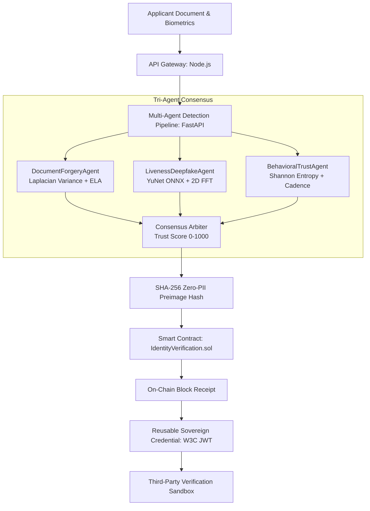

# VeriTrust AI — Multi-Agent Deepfake & Synthetic Identity KYC Verification

An institutional-grade verification platform combining autonomous multi-modal AI agents with on-chain Ethereum audit anchoring. Designed to detect generative AI deepfakes, synthetic identities, and forged documents in automated KYC pipelines without storing raw PII on-chain.

---

## 1. Problem Statement

Automated KYC verification systems face an existential challenge from generative AI:
1. **Diffusion & GAN Face-Swapping**: Attackers inject deepfake video streams into browser video feeds using virtual cameras or loop injection, defeating single-frame selfie checks.
2. **Document Tampering**: Tools like Photoshop and generative inpainting produce spliced IDs with inconsistent JPEG compression artifacts and kerning irregularities that pass standard OCR.
3. **Sybil Script Automation**: Headless browsers with programmatic inputs mimic human onboarding flows at scale.
4. **Centralized PII Vulnerability**: Storing identity documents and biometric images in centralized databases creates permanent breach liabilities under GDPR, CCPA, and BIPA.

**VeriTrust AI** resolves this by executing a concurrent tri-agent detection pipeline, synthesizing a cryptographic reasoning consensus, and committing a zero-PII 32-byte SHA-256 preimage hash to an Ethereum smart contract.

---

## 2. Architecture Overview

```
 ┌────────────────────────────────────────────────────────────────────────┐
 │                      FRONTEND (React + Vite + Tailwind)                │
 │    • Custom Ambient Canvas Mesh   • 3D Tilt Cards    • Magnetic CTAs   │
 │    • Real-Time Stage HUD          • Reusable Verifiable Credential     │
 └───────────────────────────────────┬────────────────────────────────────┘
                                     │ HTTP REST (JSON / Base64)
                                     ▼
 ┌────────────────────────────────────────────────────────────────────────┐
 │                   API GATEWAY (Node.js + Express)                      │
 │    • JWT Authentication & Tenant Isolation (SARAH / MARCUS)            │
 │    • Input Validation & Rate Limiting                                  │
 │    • SHA-256 Preimage Computation: SHA256(DOC:...::TRAIL:...)          │
 └──────────────┬──────────────────────────────────────────┬──────────────┘
                │                                          │
                │ Async Inference Request                  │ ethers.js v6
                ▼                                          ▼
 ┌──────────────────────────────┐        ┌────────────────────────────────┐
 │ AGENTS SERVICE (FastAPI)     │        │ BLOCKCHAIN LEDGER (Hardhat)    │
 │                              │        │                                │
 │ • DocumentForgeryAgent       │        │ IdentityVerification.sol       │
 │   - Laplacian Sharpness      │        │ • identityHash (bytes32)       │
 │   - ELA Splicing Analysis    │        │ • trustScore (0-1000)          │
 │   - Font Kerning Jitter      │        │ • verdict (VERIFIED/REJECTED)  │
 │                              │        │ • timestamp                    │
 │ • LivenessDeepfakeAgent      │        │ • verifierAgent                │
 │   - YuNet ONNX (5-pt reticle)│        │                                │
 │   - 2D FFT Spectral Roll-Off │        │ Reusable Verified Credential   │
 │   - Kinematic Blink Dips     │        │ • Portable signed JWT          │
 │                              │        │ • POST /credential/verify      │
 │ • BehavioralTrustAgent       │        └────────────────────────────────┘
 │   - Shannon Mouse Entropy    │
 │   - Keystroke Interval CV    │
 └──────────────────────────────┘
```

### Mermaid Flowchart



---

## 3. Technology Stack

| Layer | Technologies | Purpose |
|---|---|---|
| **Frontend** | React 18, Vite 5, Tailwind CSS, Framer Motion, Lucide Icons | 60fps institutional UI, custom HTML5 canvas mesh, magnetic buttons, 3D tilt cards |
| **API Gateway** | Node.js, Express, ethers.js v6, crypto (HMAC-SHA256) | Request orchestration, SHA-256 preimage hashing, JWT issuance, contract binding |
| **Agents Microservice** | Python 3.10+, FastAPI, OpenCV 5, NumPy, YuNet ONNX | Multimodal detection: FFT spectral analysis, facial landmarks, Shannon entropy |
| **Blockchain** | Solidity 0.8.28, Hardhat, Ethers.js | Tamper-proof verification registry, zero-PII audit trail, event emission |
| **Security & Auth** | Signed JWT (HS256 / secp256k1), SHA-256 Preimage Root | Multi-tenant audit isolation, portable reusable credentials |

---

## 4. How to Run Locally

### Option A: Using Docker Compose (Single Command)

```bash
docker-compose up --build
```
- Frontend: `http://localhost:5173`
- Backend API Gateway: `http://localhost:4000`
- Agents Microservice: `http://localhost:8000`
- Hardhat EVM Node: `http://localhost:8545`

---

### Option B: Running Individual Services Manually

#### 1. Start Hardhat Blockchain Node
```bash
cd blockchain
npm install
npx hardhat node
# In a second terminal, deploy the contract:
npx hardhat run scripts/deploy.js --network localhost
```
*Writes deployed address and ABI to `shared/contract-config.json`.*

#### 2. Start Python Agents Microservice
```bash
cd agents
pip install -r requirements.txt
python -m uvicorn main:app --host 127.0.0.1 --port 8000
```
*Health check at `http://127.0.0.1:8000/health`.*

#### 3. Start Backend API Gateway
```bash
cd backend
npm install
npm run seed  # Pre-seeds 6 realistic audit records
npm start
```
*Gateway running at `http://127.0.0.1:4000`.*

#### 4. Start Frontend
```bash
cd frontend
npm install
npm run dev
```
*UI live at `http://127.0.0.1:5173`.*

---

## 5. Project Highlights (Engineering Decisions)

### 1. 2D FFT Spectral Roll-Off for Deepfake Detection
Generative models (StyleGAN, diffusion upsamplers) generate images using transposed convolutions or attention grids that leave periodic grid artifacts in the frequency domain. `LivenessDeepfakeAgent` converts facial crops to grayscale and runs a 2D Fast Fourier Transform (`np.fft.fft2`). By measuring the high-frequency vs. low-frequency energy ratio, the agent detects synthetic generation even when spatial skin smoothing looks imperceptible to human eyes.

### 2. CPU-Optimized Face & Landmark Tracking (YuNet ONNX)
Rather than requiring a multi-gigabyte PyTorch/CUDA runtime, the agent uses the YuNet ONNX model (232 KB). It runs inference via OpenCV DNN in ~15ms on a standard CPU, reliably extracting bounding boxes and 5 facial landmark reticles (eyes, nose, mouth corners) to measure blink kinematic dips and head movement.

### 3. Discrete Shannon Entropy for Bot Detection
Script-driven automated attacks produce unnaturally straight cursor trajectories and uniform typing cadences. `BehavioralTrustAgent` computes the discrete Shannon entropy over mouse directional angles:
$$H = -\sum_{i=1}^n p_i \log_2(p_i)$$
Human users typically register $H \in [2.8, 4.2]$ bits due to natural biomechanical micro-corrections, whereas automated bots register $H < 0.8$ bits.

### 4. Zero-PII SHA-256 Preimage Anchoring
Committing names, passport numbers, or biometric vectors on a public or consortium blockchain violates GDPR Article 17 (Right to Erasure). VeriTrust AI hashes:
`SHA256("DOC:" + docType + ":" + docNumber + ":" + docDataHash + "::TRAIL:" + reasoningTrail)`
The resulting 32-byte hash (`bytes32`) is committed on-chain. If an insider maliciously alters the off-chain database record, recomputing the hash yields a mismatch, instantly flagging the tampering while never revealing raw identity data on-chain.

### 5. Reusable Verifiable Credentials (W3C/JWT)
Upon passing verification (`VERIFIED`), the gateway issues an HMAC-SHA256 signed credential token containing the subject DID, trust score, and on-chain transaction hash. Any third-party partner institution can call `POST /credential/verify` to validate both the cryptographic signature and cross-check the live smart contract to ensure the record has not been revoked.

---

## 6. Pre-Seeded Demo Accounts

| Account Name | Email | Password | Role | Institution |
|---|---|---|---|---|
| **Sarah Chen** | `officer@veritrust.ai` | `password123` | Compliance Officer | VeriTrust Global Security |
| **Marcus Cole** | `analyst@apexbank.com` | `password123` | Risk Analyst | Apex Global Bank |

*Switch accounts using the top-right profile switcher in the frontend navigation to observe per-user audit ledger isolation.*
